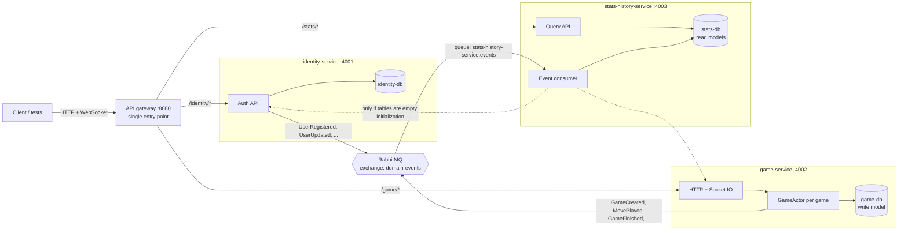

<h1 align="center">
  
  <br />
  Chess-U
</h1>

<p align="center">
  Real-time online chess built as event-driven microservices:<br />
  <b>actor model</b>, <b>CQRS</b>, <b>RabbitMQ</b>, <b>Docker</b> and a full <b>CI/CD</b> pipeline to AWS.
</p>

<p align="center">
  
</p>

## About

Players create a game, join it, and play moves in real time over Socket.IO. When a game ends,
the result is published as an event, and a separate service builds the leaderboard and game
history from those events.

The chess application itself is based on the open-source project
[dotnize/chessu](https://github.com/dotnize/chessu) (MIT). This project splits its single backend
into three independent microservices behind an API gateway, each with its own database, that
share data only through RabbitMQ events. It also adds the actor model with supervision, the
CQRS read side, Docker Compose, the test suites and the CI/CD pipeline.

The focus is the backend. A Next.js frontend is included in `client/` and is optional; the
backend's behaviour is covered by automated tests (see [Tests](#tests)).

## Key concepts

| Concept | Where |
|---|---|
| Microservices | `services/identity-service`, `services/game-service`, `services/stats-history-service`: separately built, deployed and restarted |
| API gateway | [`services/api-gateway`](services/api-gateway/src/server.ts): the single public entry point; forwards `/identity`, `/game`, `/stats` to the owning service |
| Database per service | `identity-db`, `game-db`, `stats-db`: three PostgreSQL containers, no shared database |
| Message queue | RabbitMQ topic exchange `domain-events`: publishers in each service's `publisher.ts`, consumer in [`stats-history-service/src/consumer.ts`](services/stats-history-service/src/consumer.ts) |
| CQRS | Commands: `game-service` writes `game_write`. Queries: `stats-history-service` serves the `player_stats` and `game_history` read models built from events |
| Actor model | [`game-service/src/actor.ts`](services/game-service/src/actor.ts): every active game is a `GameActor` with a private state and a mailbox; [`supervisor.ts`](services/game-service/src/supervisor.ts) restarts crashed actors ("let it crash") |
| Independent services | game-service verifies signed user tokens itself, so games keep working while identity-service is down; a new stats-history-service initializes its empty tables from the owning services |
| Docker | One Dockerfile per service, and the whole system in [`docker-compose.yml`](docker-compose.yml) |
| CI/CD | [`.github/workflows/ci.yml`](.github/workflows/ci.yml) (lint, build, tests) and [`.github/workflows/deploy-ec2.yml`](.github/workflows/deploy-ec2.yml) (deploy to AWS EC2) |

## Architecture



Clients only talk to the API gateway. The services never call each other during normal operation:
data is shared through events, and users are identified by a token that every service can verify
on its own. The only direct calls are the one-time initialization of an empty read model (dotted arrows).

### Services

All routes below are reached through the gateway with the service prefix, e.g.
`POST http://localhost:8080/game/v1/games`.

| Service | Responsibility | Own database | HTTP API |
|---|---|---|---|
| `api-gateway` | Single entry point, routing, CORS, hides internal endpoints, returns 503 for a service that is down | none | `/identity/*`, `/game/*`, `/stats/*` |
| `identity-service` | Guest sessions, registration, login, profile updates; issues signed user tokens | `identity-db`: `identity_user`, sessions | `POST /v1/auth/guest`, `/register`, `/login`, `/logout`, `GET` / `PATCH /v1/auth` |
| `game-service` | Game creation and live play; one actor per active game | `game-db`: `game_write` | `GET` / `POST /v1/games`, `GET /v1/games/:code`, Socket.IO events |
| `stats-history-service` | Leaderboard, game history and player profiles (read side) | `stats-db`: `player_stats`, `game_history`, `processed_events` | `GET /v1/leaderboard`, `GET /v1/games?id=` / `?userid=`, `GET /v1/users/:name` |

Every service also exposes `GET /health`. Endpoints under `/v1/internal/` are for
service-to-service calls only; the gateway does not expose them.

### Events

All events go to the RabbitMQ topic exchange `domain-events`, with the event type as the routing key:

```json
{ "id": "uuid", "type": "GameFinished", "source": "game-service", "occurredAt": "…", "payload": { … } }
```

| Event | Published by | Consumed by | Effect on the consumer |
|---|---|---|---|
| `UserRegistered` | identity-service | stats-history-service | Creates the player in `player_stats` |
| `UserUpdated` | identity-service | stats-history-service | Updates the player's display name |
| `GuestSessionStarted`, `UserLoggedIn` | identity-service | none | Published for future consumers |
| `GameCreated`, `PlayerJoinedGame`, `MovePlayed` | game-service | none | Published for future consumers |
| `GameFinished` | game-service | stats-history-service | Adds a row to `game_history` and updates wins, losses and draws |

### CQRS

- **Command side:** `game-service` handles commands (create game, join, move) and stores the
  authoritative game state in its write model (`game_write` in `game-db`).
- **Query side:** `stats-history-service` never reads `game-db`. It builds its own read models
  (`player_stats`, `game_history`) from events and serves all leaderboard, history and profile
  queries from them.
- The two sides are **eventually consistent**: the read model is updated a few milliseconds
  after the event is published.

### Actor model

Each active game is a [`GameActor`](services/game-service/src/actor.ts):

- The actor owns its game state privately; no other code mutates it.
- Other code only sends it messages: `UserJoined`, `UserLeft`, `JoinAsPlayer`, `SendMove`, `ClaimAbandoned`.
- Messages wait in the actor's **mailbox** and are processed **strictly one at a time**, even
  though each one awaits a database write and a RabbitMQ publish. Two moves arriving at the same
  moment can never interleave.
- Different games are different actors, so they run independently.
- When the game ends, the actor publishes `GameFinished` and stops; later messages are rejected.

**Supervision and "let it crash".** The actor does not try to handle unexpected failures (for
example, the database write fails). Instead it crashes: it rejects the messages in its mailbox and
reports to its [supervisor](services/game-service/src/supervisor.ts), which:

- restarts only that actor (**one-for-one**) from the last state saved in `game-db`, throwing away
  any half-applied change; the other games are not affected
- gives up on an actor that crashes more than 3 times within a minute
- when game-service starts, recovers every game that was still active, so a restart of the
  service does not lose games in progress

Expected rule violations (illegal move, not your turn) are not crashes: they only reject that one message.

### Services work independently

- **No runtime call to identity-service:** when a user logs in, identity-service signs a JWT
  (`chessu_token` cookie). game-service verifies it locally with the shared `TOKEN_SECRET`, so
  games can be created and played while identity-service is down.
- **Initialization of empty read models:** a newly deployed stats-history-service never saw past
  events. On startup, only if its tables are empty, it asks identity-service for the users and
  game-service for the finished games once, and then continues from events. If a source service
  is down, it still starts and serves queries.
- **Gateway isolation:** if a service is down, the gateway answers `503` for that service's routes only.

### Reliability

- **Startup ordering:** services retry the RabbitMQ connection, and Docker Compose starts them only
  after RabbitMQ and their database report healthy. If the broker connection is lost, the
  service exits and Docker restarts it.
- **Durable queue:** events published while `stats-history-service` is down wait in the queue
  and are processed when it comes back.
- **Idempotent consumer:** RabbitMQ delivers *at least once*. Each event's `id` is stored in
  `processed_events` in the same transaction as the read-model update, so a redelivered event is
  skipped. A game is also recorded once per game code, even if it arrives both from the
  initialization and as an event.
- **Dead-letter queue:** a message that cannot be processed is routed to
  `stats-history-service.dead-letter` instead of being lost.
- **Ordering:** the consumer handles one message at a time (`prefetch 1`).

## Running locally

Requirements: Docker, Node.js 22.13+, [pnpm](https://pnpm.io/installation).

```sh
pnpm install

# backend: API gateway, 3 services, 3 PostgreSQL databases, RabbitMQ
docker compose up -d --build --wait api-gateway identity-service game-service stats-history-service
```

| URL | What |
|---|---|
| http://localhost:8080 | API gateway, the entry point for all calls (e.g. `/stats/v1/leaderboard`) |
| http://localhost:8080/identity/health, `/game/health`, `/stats/health` | health of each service, through the gateway |
| http://localhost:15672 | RabbitMQ management UI (`guest` / `guest`): queues, message rates, dead-letter queue |

The services (ports 4001–4003), the databases (5433–5435) and RabbitMQ are also reachable
directly from this machine for debugging, but not from other machines.

`docker compose up -d` without service names also starts the Next.js client on http://localhost:3000.

To run the services outside Docker (with only the databases and RabbitMQ in Docker), see [docs/runbook.md](docs/runbook.md).

## Tests

```sh
pnpm test:unit   # GameActor and supervisor unit tests, no Docker needed
pnpm test:e2e    # end-to-end tests, needs the Docker stack from above
```

The end-to-end tests call the system through the API gateway like a real client (HTTP and
Socket.IO), or publish directly to RabbitMQ, then check the data each microservice wrote into
**its own database**. Some of them stop, restart or wipe services with `docker compose`.

| Test | Scenario |
|---|---|
| [`01-user-events`](tests/e2e/01-user-events.test.mjs) | Registering or renaming a user in identity-service updates the copy in stats-db through RabbitMQ |
| [`02-game-cqrs`](tests/e2e/02-game-cqrs.test.mjs) | Two players finish a game over Socket.IO. The result is in the write model (game-db), then in the read models (stats-db) and the query API |
| [`03-queue-buffering`](tests/e2e/03-queue-buffering.test.mjs) | stats-history-service is **stopped**, a game is played, `GameFinished` waits in RabbitMQ, and the service catches up after restart |
| [`04-idempotency-dead-letter`](tests/e2e/04-idempotency-dead-letter.test.mjs) | The same event delivered twice is counted once; an invalid message ends up in the dead-letter queue |
| [`05-api-gateway`](tests/e2e/05-api-gateway.test.mjs) | The gateway routes each prefix to its service, hides internal endpoints and handles CORS |
| [`06-initialization`](tests/e2e/06-initialization.test.mjs) | stats-db is **wiped**, and the restarted service rebuilds users, games and stats from the owning services |
| [`07-identity-down`](tests/e2e/07-identity-down.test.mjs) | identity-service is **stopped**, and a full game is still played and recorded; the gateway returns 503 only for identity |
| [`08-game-recovery`](tests/e2e/08-game-recovery.test.mjs) | game-service is **restarted** mid-game, the supervisor recovers the game, and the players finish it |
| [`actor.test.mjs`](services/game-service/test/actor.test.mjs) | The actor processes concurrent messages one at a time; simultaneous moves and joins cannot race |
| [`supervisor.test.mjs`](services/game-service/test/supervisor.test.mjs) | A crashed actor is restarted from its saved state without affecting other games, rule violations don't restart it, and it gives up after too many crashes |

## CI/CD

**CI** ([`ci.yml`](.github/workflows/ci.yml)) runs on every push to `main` / `microsservices` and on pull requests:

1. Lint, and build the shared package, services and client
2. Run the actor and supervisor unit tests
3. Start the Docker Compose stack and run the end-to-end tests
4. Validate the Compose file and build every Docker image

**CD** ([`deploy-ec2.yml`](.github/workflows/deploy-ec2.yml)) runs after CI succeeds (or manually):

1. Build the four images (gateway and three services) and push them to GitHub Container Registry, tagged with the commit SHA
2. Copy `docker-compose.yml` to the EC2 server over SSH, pull the new images, and restart the
   services with `docker compose up --wait`
3. Check each service's `/health` through the public gateway

### AWS deployment

The backend runs on a single EC2 instance with the same Docker Compose setup used locally.
Only the API gateway (port 80) and SSH are public; the services, databases and RabbitMQ listen
only on the server's `127.0.0.1`.

- [`infrastructure/ec2/user-data.sh`](infrastructure/ec2/user-data.sh): first-boot setup (Docker, Compose, swap)
- [`infrastructure/ec2/tunnel.sh`](infrastructure/ec2/tunnel.sh): SSH tunnel so `pnpm test:e2e` can run against the deployed stack

Required GitHub Actions secrets:

| Secret | Value |
|---|---|
| `EC2_HOST` | Public IP of the instance (Elastic IP) |
| `EC2_USER` | `ec2-user` |
| `EC2_SSH_KEY` | Private SSH key for the instance |
| `SESSION_SECRET` | Random string used to sign session cookies |
| `TOKEN_SECRET` | Random string used to sign and verify user tokens |

## Project structure

```text
services/
  api-gateway/             single entry point, routes requests to the services
  identity-service/        auth and users, issues user tokens, publishes user events
  game-service/            game commands, GameActor + supervisor, Socket.IO, publishes game events
  stats-history-service/   event consumer, read-model initialization and query API
packages/shared/           shared helpers: DB pool, RabbitMQ connection, event publisher, user tokens
types/                     shared TypeScript domain types
tests/e2e/                 end-to-end tests
client/                    Next.js frontend (optional)
infrastructure/ec2/        EC2 bootstrap and tunnel scripts
docs/                      runbook and migration notes
server/, infrastructure/template.yaml
                           legacy monolith and AWS SAM serverless backend, not part of the microservices
```

## Known limitations

- **Dual write:** game-service saves to its database and then publishes to RabbitMQ in two separate
  steps. A crash between them would lose the event. The standard fix is the transactional outbox pattern.
- **Single instance:** game-service can't be scaled to several instances as is, because a game's
  actor lives in one process. That would need sticky routing or an actor framework with clustering.
- **Stateless tokens:** a user token stays valid until it expires (30 days), even after logout,
  because services verify it without asking identity-service. Revoking tokens early would need a
  short expiry with refresh tokens, or a revocation list shared through events.

## Documentation

- [docs/runbook.md](docs/runbook.md): running the services without Docker, test commands
- [docs/microservices-migration.md](docs/microservices-migration.md): how the monolith was split

## License

[MIT](./LICENSE). The original chess application is © Nathaniel Tampus ([dotnize/chessu](https://github.com/dotnize/chessu)).
